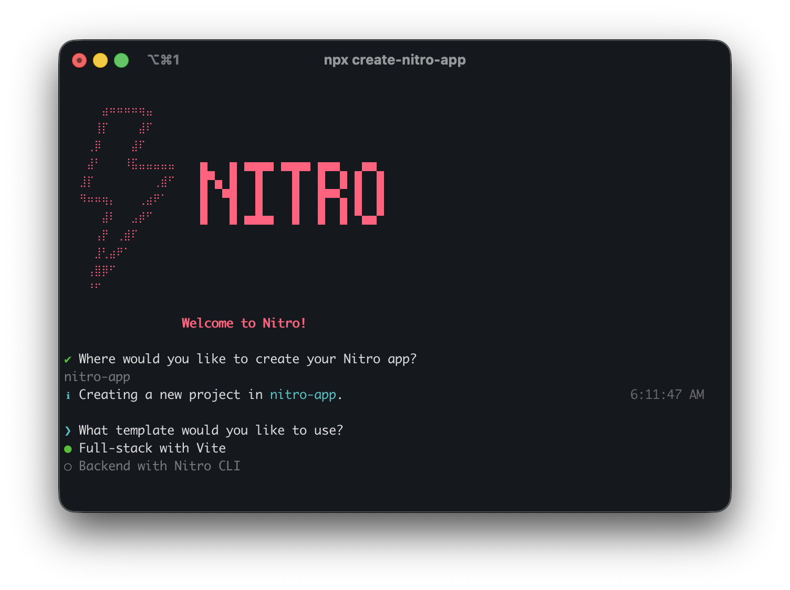

# create-nitro-app

<!-- automd:badges color=ff637e labelColor=18181B -->

[](https://npmjs.com/package/create-nitro-app)
[](https://npm.chart.dev/create-nitro-app)

<!-- /automd -->

Create a nitro app

```sh
npx create-nitro-app
```

<details>

<summary>Other package managers</summary>

#### pnpm

```sh
pnpx create-nitro-app
```

#### yarn

```sh
yarn dlx create-nitro-app
```

#### bun

```sh
bunx create-nitro-app
```

#### deno

```sh
deno run -A npm:create-nitro-app
```

</details>

<div style="display:flex;justify-content:center;">
  
</div>

## Development

<details>

<summary>local development</summary>

- Clone this repository
- Install latest LTS version of [Node.js](https://nodejs.org/en/)
- Enable [Corepack](https://github.com/nodejs/corepack) using `corepack enable`
- Install dependencies using `pnpm install`
- Try CLI using `pnpm create-nitro-app`

</details>

## License

<!-- automd:contributors license=MIT -->

Published under the [MIT](https://github.com/nitrojs/create-nitro-app/blob/main/LICENSE) license.
Made by [community](https://github.com/nitrojs/create-nitro-app/graphs/contributors) 💛
<br><br>
<a href="https://github.com/nitrojs/create-nitro-app/graphs/contributors">

</a>

<!-- /automd -->
